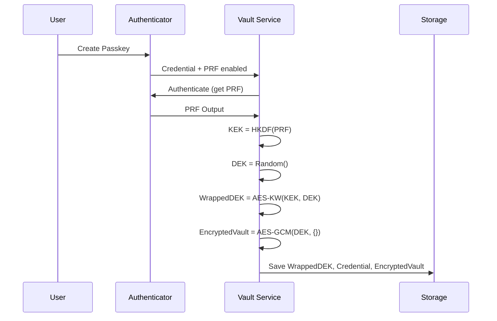
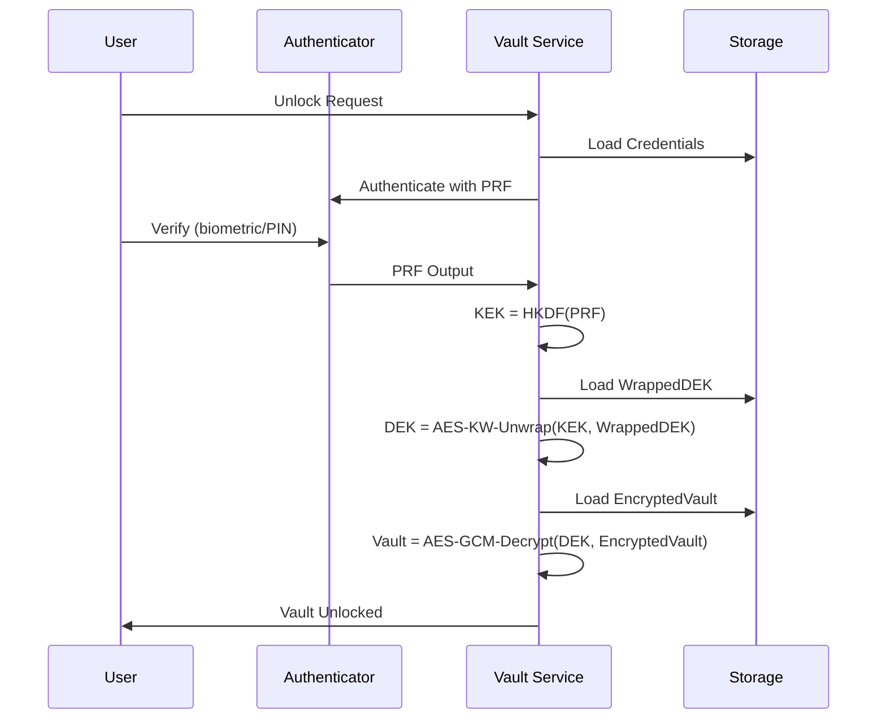
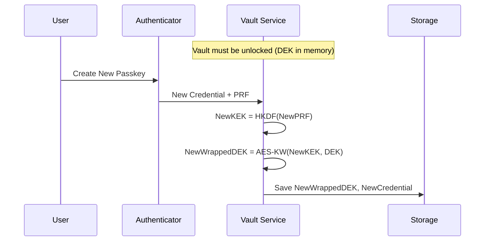

# Architecture Overview

This document describes the technical architecture of Passwordless Vault.

## Table of Contents

- [System Overview](#system-overview)
- [Envelope Encryption](#envelope-encryption)
- [Key Hierarchy](#key-hierarchy)
- [Data Flow](#data-flow)
- [Module Design](#module-design)

## System Overview

Passwordless Vault is a client-side application that stores encrypted secrets in the browser's IndexedDB. It uses the WebAuthn PRF extension to derive cryptographic keys from hardware-backed passkeys, eliminating the need for passwords.

```
┌────────────────────────────────────────────────────────────────────┐
│                          Application Layer                         │
│  ┌──────────────┐  ┌──────────────┐  ┌──────────────────────────┐ │
│  │    Views     │  │  Components  │  │      Vault Service       │ │
│  │  (Svelte)    │  │   (Svelte)   │  │   (Orchestration)        │ │
│  └──────────────┘  └──────────────┘  └──────────────────────────┘ │
├────────────────────────────────────────────────────────────────────┤
│                          Domain Layer                              │
│  ┌──────────────────┐  ┌──────────────────┐  ┌─────────────────┐  │
│  │   Crypto Module  │  │  WebAuthn Module │  │ Storage Module  │  │
│  │  - Encryption    │  │  - PRF Extension │  │  - IndexedDB    │  │
│  │  - KDF           │  │  - Credentials   │  │  - Validation   │  │
│  │  - Key Wrapping  │  │  - Capabilities  │  │  - Schemas      │  │
│  └──────────────────┘  └──────────────────┘  └─────────────────┘  │
├────────────────────────────────────────────────────────────────────┤
│                         Platform Layer                             │
│  ┌──────────────────┐  ┌──────────────────┐  ┌─────────────────┐  │
│  │  Web Crypto API  │  │  WebAuthn API    │  │   IndexedDB     │  │
│  └──────────────────┘  └──────────────────┘  └─────────────────┘  │
└────────────────────────────────────────────────────────────────────┘
```

## Envelope Encryption

The vault uses **envelope encryption** as recommended by NIST SP 800-57. This pattern separates key management from data encryption.

### Why Envelope Encryption?

1. **Key Rotation**: Can add/remove passkeys without re-encrypting all data
2. **Multi-Device**: Multiple passkeys can unlock the same vault
3. **Efficiency**: Only small wrapped keys need to be re-encrypted per passkey

### Structure

```
┌─────────────────────────────────────────────────────────────┐
│                    Per-Credential Data                      │
│  ┌───────────────────────────────────────────────────────┐ │
│  │ Wrapped DEK = AES-KW(KEK, DEK)                        │ │
│  │   - credentialId: identifies which passkey            │ │
│  │   - wrappedKey: DEK encrypted with this passkey's KEK │ │
│  │   - prfSalt: unique salt for this credential          │ │
│  └───────────────────────────────────────────────────────┘ │
└─────────────────────────────────────────────────────────────┘

┌─────────────────────────────────────────────────────────────┐
│                    Shared Vault Data                        │
│  ┌───────────────────────────────────────────────────────┐ │
│  │ Encrypted Vault = AES-GCM(DEK, VaultData)             │ │
│  │   - IV: 96-bit random nonce (prepended)               │ │
│  │   - Ciphertext: encrypted JSON                        │ │
│  │   - Auth Tag: 128-bit integrity tag                   │ │
│  └───────────────────────────────────────────────────────┘ │
└─────────────────────────────────────────────────────────────┘
```

## Key Hierarchy

```
                    ┌─────────────────┐
                    │    Passkey      │
                    │  (Authenticator)│
                    └────────┬────────┘
                             │
                             │ PRF Extension
                             │ (hardware-backed)
                             ▼
                    ┌─────────────────┐
                    │   PRF Output    │
                    │   (32 bytes)    │
                    └────────┬────────┘
                             │
                             │ HKDF-SHA256
                             │ (salt + info)
                             ▼
                    ┌─────────────────┐
                    │      KEK        │
                    │ (Key Encryption │
                    │     Key)        │
                    │   256-bit       │
                    └────────┬────────┘
                             │
                             │ AES-KW (unwrap)
                             ▼
                    ┌─────────────────┐
                    │      DEK        │
                    │(Data Encryption │
                    │     Key)        │
                    │   256-bit       │
                    └────────┬────────┘
                             │
                             │ AES-GCM
                             ▼
                    ┌─────────────────┐
                    │   Vault Data    │
                    │   (Plaintext)   │
                    └─────────────────┘
```

### Key Types

| Key            | Purpose             | Derivation             | Storage        |
| -------------- | ------------------- | ---------------------- | -------------- |
| **PRF Output** | Raw key material    | Hardware authenticator | Never stored   |
| **KEK**        | Wraps/unwraps DEK   | HKDF(PRF, salt, info)  | Never stored   |
| **DEK**        | Encrypts vault data | Random generation      | Stored wrapped |

## Data Flow

### Vault Setup (First Time)



### Vault Unlock



### Adding a New Passkey



## Module Design

### Crypto Module (`$crypto`)

Handles all cryptographic operations using Web Crypto API.

```typescript
// Key derivation
deriveKEK(prfOutput: Uint8Array): Promise<CryptoKey>

// Key generation and wrapping
generateDEK(): Promise<CryptoKey>
wrapDEK(dek: CryptoKey, kek: CryptoKey): Promise<Uint8Array>
unwrapDEK(wrapped: Uint8Array, kek: CryptoKey): Promise<CryptoKey>

// Encryption
encryptObject<T>(key: CryptoKey, data: T): Promise<string>
decryptObject<T>(key: CryptoKey, encrypted: string): Promise<T>
```

### WebAuthn Module (`$webauthn`)

Handles WebAuthn credential management and PRF extension.

```typescript
// Credential operations
createCredential(userName: string, name: string): Promise<CredentialCreationResult>
authenticateWithCredential(credential: StoredCredential): Promise<AuthenticationResult>
authenticateWithAnyCredential(credentials: StoredCredential[]): Promise<AuthenticationResult>

// Capability detection
checkPRFSupport(): Promise<PRFSupportResult>
```

### Storage Module (`$storage`)

Handles data persistence in IndexedDB.

```typescript
// Vault operations
saveEncryptedVault(encrypted: string): Promise<void>
loadEncryptedVault(): Promise<string | null>

// Credential management
saveCredentials(credentials: StoredCredential[]): Promise<void>
loadCredentials(): Promise<StoredCredential[]>

// Wrapped DEK management
saveWrappedDEKs(deks: WrappedDEK[]): Promise<void>
getWrappedDEKForCredential(credentialId: string): Promise<WrappedDEK | null>
```

### Vault Service (`$services`)

Orchestrates all modules to provide a high-level API.

```typescript
// Vault lifecycle
setupVault(userName: string, passkeyName: string): Promise<VaultState>
unlockVault(): Promise<UnlockResult>
lockVault(): void

// Passkey management
addPasskey(name: string): Promise<StoredCredential[]>
removePasskey(credentialId: string): Promise<StoredCredential[]>

// Item management
addVaultItem(item: VaultItem): Promise<VaultItem>
updateVaultItem(id: string, updates: Partial<VaultItem>): Promise<VaultItem>
deleteVaultItem(id: string): Promise<void>
```

