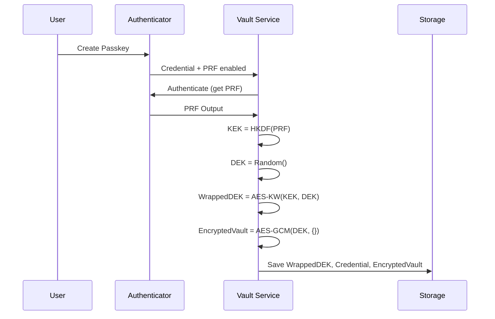
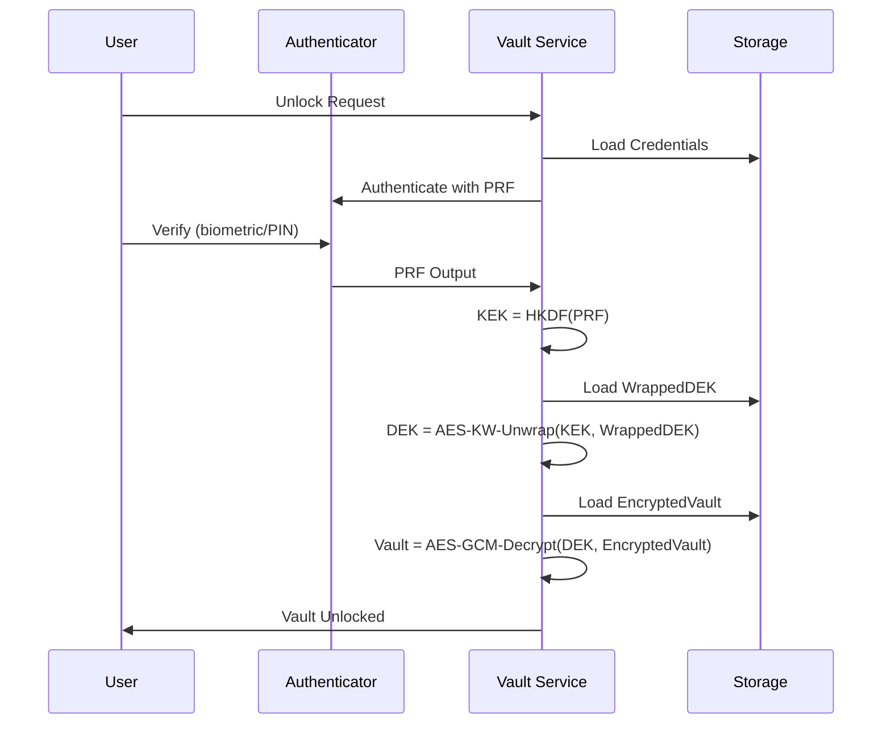
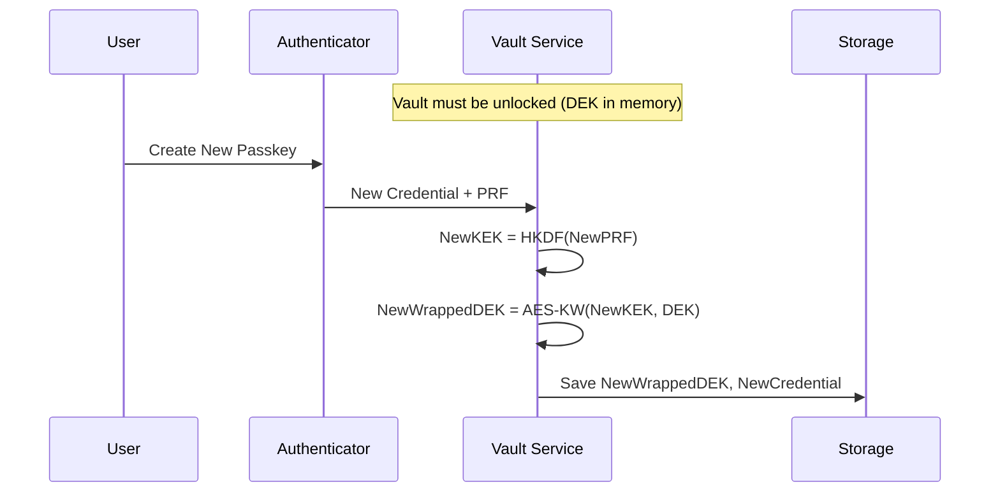

# Architecture Overview

This document describes the technical architecture of Passwordless Vault.

## Table of Contents

- [System Overview](#system-overview)
- [Domain-Driven Design Architecture](#domain-driven-design-architecture)
- [Envelope Encryption](#envelope-encryption)
- [Key Hierarchy](#key-hierarchy)
- [Data Flow](#data-flow)
- [Module Design](#module-design)

## System Overview

Passwordless Vault is a client-side application that stores encrypted secrets in the browser's IndexedDB. It uses the WebAuthn PRF extension to derive cryptographic keys from hardware-backed passkeys, eliminating the need for passwords.

```
┌────────────────────────────────────────────────────────────────────┐
│                          Application Layer                         │
│  ┌──────────────┐  ┌──────────────┐  ┌──────────────────────────┐ │
│  │    Views     │  │  Components  │  │      Vault Service       │ │
│  │  (Svelte)    │  │   (Svelte)   │  │   (Orchestration)        │ │
│  └──────────────┘  └──────────────┘  └──────────────────────────┘ │
├────────────────────────────────────────────────────────────────────┤
│                          Domain Layer                              │
│  ┌──────────────────┐  ┌──────────────────┐  ┌─────────────────┐  │
│  │   Crypto Module  │  │  WebAuthn Module │  │ Storage Module  │  │
│  │  - Encryption    │  │  - PRF Extension │  │  - IndexedDB    │  │
│  │  - KDF           │  │  - Credentials   │  │  - Validation   │  │
│  │  - Key Wrapping  │  │  - Capabilities  │  │  - Schemas      │  │
│  └──────────────────┘  └──────────────────┘  └─────────────────┘  │
├────────────────────────────────────────────────────────────────────┤
│                         Platform Layer                             │
│  ┌──────────────────┐  ┌──────────────────┐  ┌─────────────────┐  │
│  │  Web Crypto API  │  │  WebAuthn API    │  │   IndexedDB     │  │
│  └──────────────────┘  └──────────────────┘  └─────────────────┘  │
└────────────────────────────────────────────────────────────────────┘
```

## Domain-Driven Design Architecture

This application follows **Domain-Driven Design (DDD)** principles to maintain clear boundaries, enforce business rules, and ensure maintainability. See `docs/EVENT_STORMING.md` for the complete domain model.

### Bounded Contexts

The application is organized into **five bounded contexts**, each with distinct responsibilities:

#### 1. Crypto Context (`src/lib/crypto/`)

**Purpose:** Pure cryptographic operations

**Characteristics:**

- **Stateless** - All functions are pure with no side effects
- **No business logic** - Only cryptographic transformations
- **Testable in isolation** - No dependencies on other contexts

**Key Operations:**

- Key derivation (HKDF)
- Key generation and wrapping (AES-KW)
- Encryption/decryption (AES-GCM)
- File encryption utilities

**Rules:**

- Never stores state
- Never knows about vault structure
- Never accesses storage or WebAuthn

#### 2. WebAuthn Context (`src/lib/webauthn/`)

**Purpose:** WebAuthn credential management and PRF extension

**Characteristics:**

- Manages passkey lifecycle
- Handles PRF extension operations
- Detects browser capabilities

**Key Operations:**

- Create credentials
- Authenticate with credentials
- PRF output retrieval
- Capability detection

**Rules:**

- No knowledge of vault structure
- No knowledge of encryption keys
- Focuses solely on credential management

#### 3. Storage Context (`src/lib/storage/`)

**Purpose:** Data persistence and validation

**Characteristics:**

- IndexedDB operations
- Data validation (Zod schemas)
- Type definitions for domain entities

**Key Operations:**

- Save/load encrypted vault
- Manage credentials storage
- Manage wrapped DEK storage
- File blob storage

**Rules:**

- No business logic
- Validation only
- No knowledge of encryption keys
- Never accesses service layer

#### 4. Vault Service Context (`src/lib/services/`)

**Purpose:** Domain orchestration and business logic

**Characteristics:**

- **Aggregate Root** - Single entry point for all vault operations
- **State Management** - Manages in-memory vault state
- **Invariant Enforcement** - Ensures business rules are followed
- **Command Handler** - Processes user intentions

**Key Operations:**

- Vault lifecycle (setup, unlock, lock, reset)
- Passkey management (add, remove)
- Item management (add, update, delete)
- File management

**Rules:**

- ALL vault operations must go through this context
- Maintains aggregate invariants
- Validates prerequisites before operations
- Orchestrates other contexts

#### 5. UI Context (`src/lib/components/`)

**Purpose:** Presentation layer

**Characteristics:**

- Svelte components
- User interface logic
- Display formatting

**Rules:**

- **NO business logic** - Only presentation
- **ONLY interacts with Vault Service** - Never directly accesses crypto/storage/webauthn
- Can import types for display purposes
- All operations go through service layer

### The Vault Aggregate

The **Vault Aggregate** is the core of the domain model, managed by `VaultService`.

#### Aggregate Root

`VaultService` (`src/lib/services/vault-service.ts`) is the single aggregate root. All vault operations must go through this service.

#### Invariants

The aggregate enforces these business rules:

1. **At least one passkey must exist** - Cannot remove the last passkey
2. **DEK must be wrapped for every passkey** - Each passkey has its own wrapped DEK
3. **Vault must be unlocked to modify** - Items and passkeys can only be modified when unlocked
4. **State transitions are atomic** - State changes happen atomically

#### State Machine

```
NotSetup → (SetupVault) → Unlocked
Unlocked → (LockVault) → Locked
Locked → (UnlockVault) → Unlocked
```

### Commands and Domain Events

#### Commands

Commands represent user intentions and are named in imperative form:

- `setupVault(userName, passkeyName)` - Create new vault
- `unlockVault()` - Unlock with passkey
- `lockVault()` - Lock vault
- `addPasskey(name)` - Add new passkey
- `removePasskey(credentialId)` - Remove passkey
- `addVaultItem(item)` - Add item
- `updateVaultItem(id, updates)` - Update item
- `deleteVaultItem(id)` - Delete item

#### Domain Events

Domain events represent facts that occurred (see `docs/EVENT_STORMING.md` for complete list):

- **VaultCreated** - New vault was created
- **VaultUnlocked** - Vault was unlocked
- **VaultLocked** - Vault was locked
- **PasskeyCreated** - New passkey registered
- **VaultItemAdded** - Item was added
- **DEKWrapped** - DEK was wrapped with KEK
- And more...

**Note:** Events are currently implicit (not explicitly published) but documented for understanding the domain model.

### Dependency Rules

**Critical:** Dependencies must flow in one direction only:

```
UI Context → Vault Service → {Crypto, WebAuthn, Storage}
```

**Never:**

- ❌ Storage importing from Service
- ❌ Crypto importing from Service
- ❌ WebAuthn importing from Service
- ❌ UI importing from Crypto/Storage/WebAuthn (except types)

**Always:**

- ✅ Service imports from Crypto/WebAuthn/Storage
- ✅ UI imports from Service
- ✅ Types can be imported across contexts for display

### Value Objects

Domain entities are defined in `src/lib/storage/types.ts`:

- **VaultItem** - Represents a vault entry (note, password, secret, file)
- **VaultData** - The encrypted vault structure
- **VaultMetadata** - Vault metadata (not encrypted)
- **StoredCredential** - Registered passkey information

### Error Handling

Domain errors represent business rule violations:

```typescript
// ✅ GOOD: Domain-focused error
throw new Error('Vault must be unlocked to add a passkey');

// ❌ BAD: Technical error
throw new Error('currentDEK is null');
```

Errors are thrown at the aggregate boundary (Vault Service) and represent business rules, not technical failures.

## Envelope Encryption

The vault uses **envelope encryption** as recommended by NIST SP 800-57. This pattern separates key management from data encryption.

### Why Envelope Encryption?

1. **Key Rotation**: Can add/remove passkeys without re-encrypting all data
2. **Multi-Device**: Multiple passkeys can unlock the same vault
3. **Efficiency**: Only small wrapped keys need to be re-encrypted per passkey

### Structure

```
┌─────────────────────────────────────────────────────────────┐
│                    Per-Credential Data                      │
│  ┌───────────────────────────────────────────────────────┐ │
│  │ Wrapped DEK = AES-KW(KEK, DEK)                        │ │
│  │   - credentialId: identifies which passkey            │ │
│  │   - wrappedKey: DEK encrypted with this passkey's KEK │ │
│  │   - prfSalt: unique salt for this credential          │ │
│  └───────────────────────────────────────────────────────┘ │
└─────────────────────────────────────────────────────────────┘

┌─────────────────────────────────────────────────────────────┐
│                    Shared Vault Data                        │
│  ┌───────────────────────────────────────────────────────┐ │
│  │ Encrypted Vault = AES-GCM(DEK, VaultData)             │ │
│  │   - IV: 96-bit random nonce (prepended)               │ │
│  │   - Ciphertext: encrypted JSON                        │ │
│  │   - Auth Tag: 128-bit integrity tag                   │ │
│  └───────────────────────────────────────────────────────┘ │
└─────────────────────────────────────────────────────────────┘
```

## Key Hierarchy

```
                    ┌─────────────────┐
                    │    Passkey      │
                    │  (Authenticator)│
                    └────────┬────────┘
                             │
                             │ PRF Extension
                             │ (hardware-backed)
                             ▼
                    ┌─────────────────┐
                    │   PRF Output    │
                    │   (32 bytes)    │
                    └────────┬────────┘
                             │
                             │ HKDF-SHA256
                             │ (salt + info)
                             ▼
                    ┌─────────────────┐
                    │      KEK        │
                    │ (Key Encryption │
                    │     Key)        │
                    │   256-bit       │
                    └────────┬────────┘
                             │
                             │ AES-KW (unwrap)
                             ▼
                    ┌─────────────────┐
                    │      DEK        │
                    │(Data Encryption │
                    │     Key)        │
                    │   256-bit       │
                    └────────┬────────┘
                             │
                             │ AES-GCM
                             ▼
                    ┌─────────────────┐
                    │   Vault Data    │
                    │   (Plaintext)   │
                    └─────────────────┘
```

### Key Types

| Key            | Purpose             | Derivation             | Storage        |
| -------------- | ------------------- | ---------------------- | -------------- |
| **PRF Output** | Raw key material    | Hardware authenticator | Never stored   |
| **KEK**        | Wraps/unwraps DEK   | HKDF(PRF, salt, info)  | Never stored   |
| **DEK**        | Encrypts vault data | Random generation      | Stored wrapped |

## Data Flow

### Vault Setup (First Time)



### Vault Unlock



### Adding a New Passkey



## Module Design

### Crypto Module (`$crypto`)

Handles all cryptographic operations using Web Crypto API.

```typescript
// Key derivation
deriveKEK(prfOutput: Uint8Array): Promise<CryptoKey>

// Key generation and wrapping
generateDEK(): Promise<CryptoKey>
wrapDEK(dek: CryptoKey, kek: CryptoKey): Promise<Uint8Array>
unwrapDEK(wrapped: Uint8Array, kek: CryptoKey): Promise<CryptoKey>

// Encryption
encryptObject<T>(key: CryptoKey, data: T): Promise<string>
decryptObject<T>(key: CryptoKey, encrypted: string): Promise<T>
```

### WebAuthn Module (`$webauthn`)

Handles WebAuthn credential management and PRF extension.

```typescript
// Credential operations
createCredential(userName: string, name: string): Promise<CredentialCreationResult>
authenticateWithCredential(credential: StoredCredential): Promise<AuthenticationResult>
authenticateWithAnyCredential(credentials: StoredCredential[]): Promise<AuthenticationResult>

// Capability detection
checkPRFSupport(): Promise<PRFSupportResult>
```

### Storage Module (`$storage`)

Handles data persistence in IndexedDB.

```typescript
// Vault operations
saveEncryptedVault(encrypted: string): Promise<void>
loadEncryptedVault(): Promise<string | null>

// Credential management
saveCredentials(credentials: StoredCredential[]): Promise<void>
loadCredentials(): Promise<StoredCredential[]>

// Wrapped DEK management
saveWrappedDEKs(deks: WrappedDEK[]): Promise<void>
getWrappedDEKForCredential(credentialId: string): Promise<WrappedDEK | null>
```

### Vault Service (`$services`)

**Aggregate Root** - Orchestrates all modules and enforces business rules.

```typescript
// Vault lifecycle (Commands)
setupVault(userName: string, passkeyName: string): Promise<VaultState>
unlockVault(): Promise<UnlockResult>
lockVault(): void
resetVault(): Promise<void>

// Passkey management (Commands)
addPasskey(name: string): Promise<StoredCredential[]>
removePasskey(credentialId: string): Promise<StoredCredential[]>

// Item management (Commands)
addVaultItem(item: Omit<VaultItem, 'id' | 'createdAt' | 'modifiedAt'>): Promise<VaultItem>
updateVaultItem(id: string, updates: Partial<VaultItem>): Promise<VaultItem>
deleteVaultItem(id: string): Promise<void>
addFileItem(file: File, title?: string): Promise<VaultItem>

// Queries (Read-only)
getVaultState(): VaultState
getVaultItems(): VaultItem[]
searchVaultItems(query: string): VaultItem[]
getMaxFileSize(): number
formatFileSizeForDisplay(bytes: number): string
generateSecurePassword(length?: number): string
```

**Key Responsibilities:**

- Maintains aggregate invariants
- Validates prerequisites before operations
- Manages in-memory state (DEK)
- Orchestrates Crypto, WebAuthn, and Storage contexts
- Provides domain-focused error messages

**State Management:**

- In-memory state only (not persisted)
- Clears sensitive data (DEK) on lock
- Never exposes DEK outside the service

